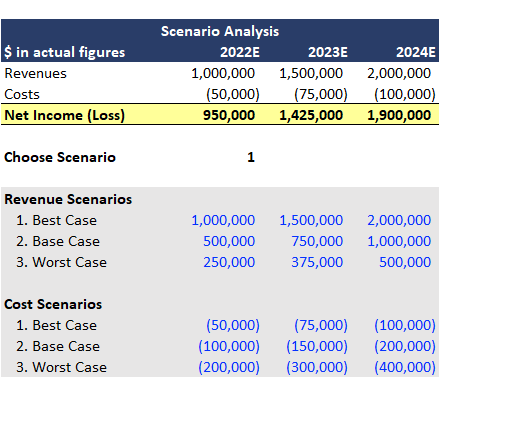
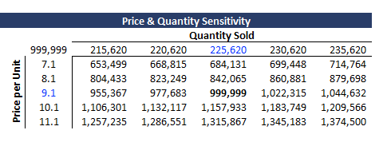
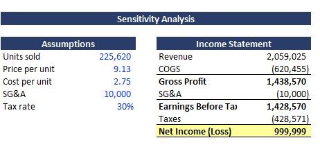
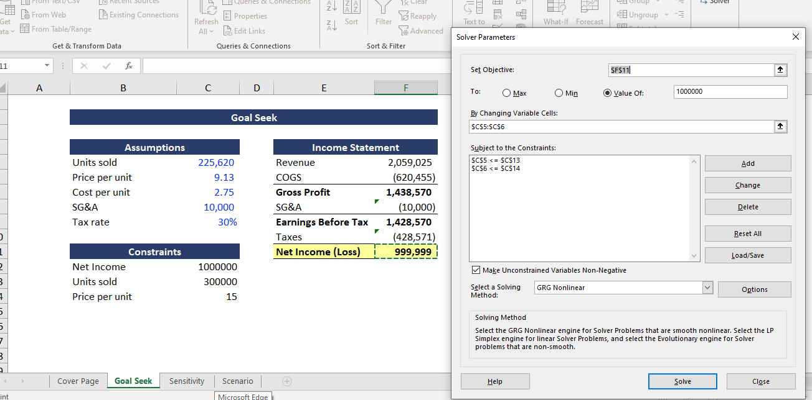

# sensitivity-scenario-analysis

# Sensitivity & Scenario Analysis Models

Excel models demonstrating Scenario Analysis, Sensitivity Analysis, Goal Seek, and Solver.

## Model Overview

This project contains practical examples of advanced Excel techniques commonly used in financial analysis and FP&A:

- Scenario Analysis (Best Case, Base Case, Worst Case)
- Sensitivity Analysis using Data Tables
- Goal Seek
- Solver for optimization

## 1. Scenario Analysis

Built using Excel’s Scenario Manager with three cases:

- Best Case
- Base Case
- Worst Case

The model allows switching between scenarios to see the impact on Net Income.

## 2. Sensitivity Analysis (Data Table)

Two-way Data Table showing the impact of changes in **Price per Unit** and **Quantity Sold** on Net Income.

## 3. Goal Seek

Used Goal Seek to determine the required inputs to achieve a target Net Income.

## 4. Solver

Applied Solver to optimize inputs under defined constraints.

## Skills Demonstrated
- Scenario Manager
- Data Tables (Sensitivity Analysis)
- Goal Seek
- Solver
- Financial modeling best practices
